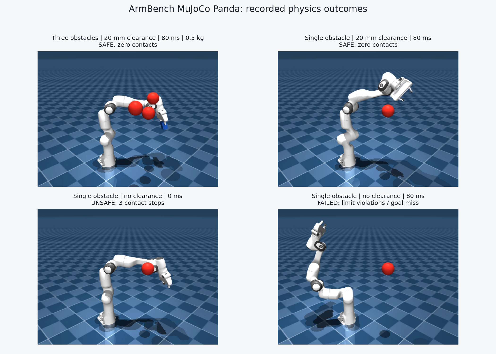

# ArmBench: Franka Panda Planning Under Delay and Contact

ArmBench is a reproducible motion-planning and rigid-body execution project for
the seven-axis Franka Emika Panda. It connects sampling-based planning to an
official MuJoCo robot model, torque-limited control, delayed observations,
payload changes, mesh contacts, contact forces, fixed-seed evaluation, and
recorded evidence.



The central experiment is deliberately narrow: a geometrically valid path can
still contact an obstacle when tracking error, feedback delay, and payload are
introduced. A matched low-bandwidth controller is evaluated with and without
20 mm of planning clearance so the effect of clearance is visible separately
from controller tuning.

## Why this is a standalone project

This is not a planner animation or a renamed simulator example. The repository
owns the complete experimental path:

```text
versioned scenario
  -> Menagerie Panda collision meshes
  -> bounded RRT-Connect / first-solution RRT* baseline
  -> collision-revalidated shortcutting
  -> velocity-limited joint trajectory
  -> delayed torque PD + gravity/bias compensation
  -> 2 ms MuJoCo rigid-body simulation
  -> contacts, forces, tracking, limits, traces, CSV/JSON, and MP4
```

The robot assets are the pinned Apache-2.0 MuJoCo Menagerie model; they are not
presented as original work. The planner integration, experiment harness,
clearance protocol, execution controller, metrics, trace viewer, tests, and
evidence packaging are ArmBench code.

## Verified scope and devices

| Layer | Current support |
|---|---|
| Simulated robot | Franka Emika Panda, 7 arm joints and 2 fingers |
| Physics | MuJoCo 3.11.0, 2 ms step, CPU rigid-body dynamics |
| Rendering | OpenGL offscreen and interactive viewer |
| Verified host | Windows, Python 3.10.8, Intel Core i9-12900H |
| Verified graphics | Intel Iris Xe; no NVIDIA GPU or CUDA required |
| Real robot | Not implemented; no `libfranka`, ROS2, or safety-rated adapter |
| Other arms | Not plug-and-play; requires a new MJCF and explicit joint/body mapping |

Isaac Lab is not used. It would add an NVIDIA/CUDA requirement without solving
the current CPU-scale question better than MuJoCo. The project can be ported to
Isaac Lab later, but that would be a separate validation rather than a truthful
description of the current repository.

## Implemented behavior

- Runtime composition of the pinned Menagerie Panda MJCF with obstacles and an
  optional 0.5 kg attached payload.
- Explicit mapping of Panda joints, limits, arm bodies, actuators, and effort
  limits; no reuse of the legacy DH coordinates for physics claims.
- Contact-based configuration and 0.05 rad resolution-bounded edge checks using
  MuJoCo collision meshes, including enabled self-contacts.
- Independently implemented bounded RRT-Connect and a first-feasible RRT*
  comparison under the same geometry, seeds, step size, and deadline.
- Collision-revalidated shortcutting and per-joint velocity-limited timing.
- Torque PD through `qfrc_applied`, MuJoCo bias-force compensation, Panda effort
  clipping, 10 ms control updates, and delayed feedback history.
- Metrics for goal error, RMSE, torque saturation, obstacle contact duration and
  events, maximum contact force and penetration, self-contact, and joint limits.
- A fixed experiment matrix over 0/40/80 ms feedback delay, 0/0.5 kg payload,
  two obstacle scenes, and three planning/control profiles.
- A collision-consistency audit comparing a 50 mm capsule skeleton built from
  official MuJoCo body origins against MuJoCo mesh contacts.
- Reproducible configs, environment capture, raw CSV, JSON aggregates, saved
  paths/traces, MP4 recordings, and an interactive trace viewer.

## Verified result snapshot

The formal run was captured from clean commit `aa9f185` on 2026-08-03. Its
tracked evidence is in
[`evidence/mujoco_formal_20260803`](evidence/mujoco_formal_20260803/summary.md).

### Planning

| Planner | Conditions | Success | P95 first-solution latency |
|---|---:|---:|---:|
| RRT-Connect | 2 scenes x 2 clearances x 10 seeds | 40/40 | 58.0-123.3 ms |
| RRT* first-solution baseline | same 40 trials | 13/40 | 2003.8-2005.3 ms |

The RRT* result is a bounded time-to-feasibility comparison, not a claim that
RRT-Connect generally dominates an asymptotically optimizing planner.

### Physics execution

Each profile has 12 deterministic conditions: two scenes, three delays, and two
payload masses.

| Profile | Clearance | Speed / gains | Safe executions |
|---|---:|---|---:|
| `nominal_fast` | 0 mm | 35%, high-bandwidth PD | 2/12 |
| `nominal_slow` | 0 mm | 10%, `kp=5`, `kd=2` | 0/12 |
| `clearance_slow` | 20 mm | same 10%, `kp=5`, `kd=2` | 12/12 |

All 12 `clearance_slow` executions reached the goal with zero obstacle contact,
zero self-contact, and zero joint-limit violation steps. The matched
`nominal_slow` profile reached the goals but recorded brief obstacle contacts in
all 12 cases. This is evidence for these fixed scenes and parameters, not a
general safety guarantee.

The capsule audit found 9 dangerous false-safe classifications and 4
false-collision classifications across 1,202 fixed random samples. That is why
the primary planner is checked against the official collision meshes.

### Videos

- [Three obstacles, 20 mm clearance, 80 ms delay, 0.5 kg payload](evidence/mujoco_formal_20260803/videos/narrow_gate__clearance_slow__delay_080ms__payload_0.5kg.mp4)
- [Single obstacle, 20 mm clearance, 80 ms delay](evidence/mujoco_formal_20260803/videos/single_block__clearance_slow__delay_080ms__payload_0.0kg.mp4)
- [Single obstacle, no clearance, nominal 0 ms execution](evidence/mujoco_formal_20260803/videos/single_block__nominal_fast__delay_000ms__payload_0.0kg.mp4)
- [Single obstacle, no clearance, unstable 80 ms execution](evidence/mujoco_formal_20260803/videos/single_block__nominal_fast__delay_080ms__payload_0.0kg.mp4)

## Setup

The repository expects the Menagerie model in the workspace-level `upstream`
directory. From `D:\arm-planning-control-project`:

```powershell
git clone --filter=blob:none --no-checkout `
  https://github.com/google-deepmind/mujoco_menagerie.git `
  .\upstream\mujoco_menagerie
git -C .\upstream\mujoco_menagerie sparse-checkout init --cone
git -C .\upstream\mujoco_menagerie sparse-checkout set franka_emika_panda
git -C .\upstream\mujoco_menagerie checkout `
  71f066ad0be9cd271f7ed58c030243ef157af9f4

py -3.10 -m venv .venv
& '.\.venv\Scripts\python.exe' -m pip install --editable '.\project[test]'
Set-Location '.\project'
```

Validate the physical scenarios and run all tests:

```powershell
& '..\.venv\Scripts\python.exe' -m armbench mujoco-validate
& '..\.venv\Scripts\python.exe' -m pytest -q
```

Run a planning-only smoke artifact, then the full physics experiment:

```powershell
& '..\.venv\Scripts\python.exe' -m armbench mujoco-run --quick `
  --run-id my_smoke
& '..\.venv\Scripts\python.exe' -m armbench mujoco-run `
  --run-id my_formal_run
```

An existing run directory is never overwritten.

## Visual debugging

Inspect an inflated planning scene and attached payload interactively:

```powershell
& '..\.venv\Scripts\python.exe' -m armbench mujoco-view `
  --scenario narrow_gate --clearance-mm 20 --payload 0.5
```

Replay the measured joint states from a formal execution:

```powershell
& '..\.venv\Scripts\python.exe' -m armbench mujoco-view `
  --scenario narrow_gate --payload 0.5 --play `
  --trace 'results\mujoco_formal_20260803\traces\narrow_gate__clearance_slow__delay_080ms__payload_0.5kg.npz'
```

Use `--array desired_positions` to replay the command instead of measured
motion, or `--frame N` to freeze one recorded sample. See
[`docs/DEBUGGING.md`](docs/DEBUGGING.md) for the failure-isolation sequence and
code entry points.

## Output contract

```text
results/<run_id>/
  config.json
  environment.json
  scenario_validation.json
  planning_per_trial.csv
  execution_per_trial.csv
  collision_samples.csv
  aggregate.json
  summary.md
  paths/*.npz
  traces/*.npz
  videos/*.mp4
  videos/*.png
  run.log
```

## Claim boundaries

- This is MuJoCo simulation, not real-Panda validation or safety certification.
- Edge checking is interpolation at a configured joint-space resolution, not
  analytic continuous collision detection.
- Current environments contain spheres; arbitrary CAD workcells are not yet
  part of the scenario schema.
- Timing constrains velocity, not acceleration or jerk.
- Delay is deterministic feedback staleness. Random jitter, dropped frames, and
  compute-deadline enforcement remain future extensions.
- Ten planning seeds per condition provide a reproducible project comparison,
  not a statistically broad robotics-paper claim.

The original NumPy/DH and decoupled-joint benchmark remains available through
`armbench run` as a legacy algorithm baseline. Its historical results are not
used as evidence about official Panda geometry or rigid-body behavior.

## Evidence-based resume wording

> Built a reproducible Franka Panda planning and MuJoCo execution benchmark
> around the pinned official Menagerie model, integrating mesh-contact
> RRT-Connect/RRT*, collision-revalidated smoothing, torque-limited delayed PD,
> payload perturbations, contact-force logging, trace replay, and fixed-seed
> artifacts. RRT-Connect solved 40/40 planning trials across two scenes and
> 0/20 mm clearance; in 36 rigid-body executions, the matched 20 mm-clearance
> profile completed 12/12 delay/load conditions without contacts, versus 0/12
> for the same low-bandwidth controller without clearance.

Use this wording only after reproducing the commands and being able to explain
the implementation and limitations in an interview.
