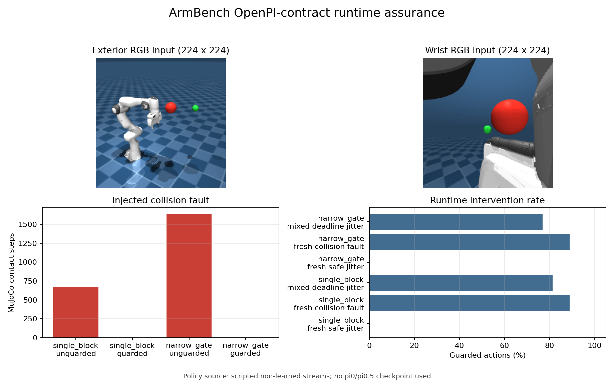

# ArmBench: OpenPI-Compatible VLA Runtime Assurance

ArmBench is a VLA deployment and evaluation project for a simulated Franka
Panda. It turns MuJoCo camera images, proprioception, and a language instruction
into the exact `pi05_droid` request contract, accepts a 15x8 action chunk from
either the official OpenPI remote client or a deterministic test policy, and
checks the chunk before torque-controlled execution.



The project does **not** train pi0/pi0.5 and the tracked benchmark does **not**
claim learned-policy performance. Its contribution is the system around a VLA:
observation adapters, remote inference boundary, deadline handling, action
validation/repair, physics execution, failure injection, and auditable evidence.

## System boundary

```text
MuJoCo Panda episode
  exterior RGB (224x224 uint8)
  wrist RGB    (224x224 uint8)
  7 joint positions + 1 gripper position
  language prompt
              |
              v
VLAObservation.to_openpi_droid()       exact official DROID keys
              |
              v
ActionChunkPolicy.infer(observation)
  | scripted_non_learned               local deterministic tests
  | openpi_remote                      real WebSocket/MessagePack server
              |
              v
15x8 DROID action chunk
  7 joint-velocity commands + 1 gripper-position command
              |
              v
deadline -> latched hold until explicit reset
velocity/gripper bounds -> joint limits -> mesh-edge lookahead
unsafe action -> backtrack 1.0 / 0.75 / 0.5 / 0.25 / hold
              |
              v
MuJoCo torque execution -> contacts / task error / latency / interventions
                         -> per-case, per-chunk, per-action, NPZ, PNG, MP4
```

The OpenPI client is pinned to commit
`15a9616a00943ada6c20a0f158e3adb39df2ccac`. The request uses the exact
`DroidInputs` keys, and responses must have shape `(15, 8)`. The first seven
values are treated as DROID joint-velocity commands and clipped to `[-1, 1]`
rad/s, matching the official DROID example before applying the Panda hardware
velocity limits. The final value is a normalized gripper position.

## What was implemented

- A dual-camera MuJoCo observation adapter with visible red obstacles and a
  non-colliding green task target. Automated render tests require both colors in
  both camera views, not merely nonblank pixels.
- A thin wrapper around Physical Intelligence's official `openpi-client`, with
  strict request keys, response shape, timing, sequence, and provenance checks.
- A real local WebSocket/MessagePack protocol test using the official client,
  plus `vla-probe` for a real remote OpenPI checkpoint.
- Training-free action-chunk assurance: end-to-end deadline checking, a latched
  hold state, velocity/gripper clipping, Panda joint limits, 20 mm planning
  clearance, sampled MuJoCo mesh-edge checks, and action backtracking.
- Reproducible jitter schedules (`0/40/80/160 ms`) and a mixed schedule with a
  `240 ms` deadline miss. A deadline miss latches the runtime in hold until an
  explicit reset; silently resuming an old open-loop stream is forbidden.
- Official MuJoCo Menagerie Panda dynamics, torque PD with bias compensation,
  contact forces, self-contact and joint-limit monitoring, fixed configs, raw
  traces, videos, and action-level rejection reasons.
- RRT-Connect-derived safe action streams and direct-interpolation collision
  faults. They are deliberately labeled `scripted_non_learned` everywhere.

## Verified VLA-runtime result

The formal artifact was generated from source commit `b6996ed` on 2026-08-03:
[`evidence/vla_guard_formal_20260803`](evidence/vla_guard_formal_20260803/summary.md).
It contains 12 rigid-body cases, 128 action chunks, and 1,920 action records.

| Condition across two scenes | Task success | Physical safe | Contacts | Interpretation |
|---|---:|---:|---:|---|
| Safe jitter, unguarded | 2/2 | 2/2 | 0 | Valid reference stream |
| Safe jitter, guarded | 2/2 | 2/2 | 0 | Guard preserves safe actions |
| Collision fault, unguarded | 0/2 | 0/2 | 2,314 steps | Injected unsafe stream reaches obstacles |
| Collision fault, guarded | 0/2 | 2/2 | 0 | Guard stops safely; task is intentionally incomplete |
| Mixed deadline, unguarded | 2/2 | 2/2 | 0 | Baseline ignores stale-action deadlines |
| Mixed deadline, guarded | 0/2 | 2/2 | 0 | Deadline triggers latched hold |

All 6/6 guarded cases were contact-free. Safe streams were accepted without
intervention and still completed both tasks. Collision-fault cases were repaired
or held for 80 action steps total, reducing 2,314 contact simulation steps to
zero. The mixed-deadline cases latched after the first 240 ms chunk and stopped
safely instead of claiming task completion. The maximum per-case guard P95 was
7.96 ms on the verified Intel CPU host.

These are fixed simulation cases, not a statistical safety guarantee. A safe
but incomplete episode is not counted as task success.

### Visual evidence

- [Unsafe direct action chunk](evidence/vla_guard_formal_20260803/videos/single_block__fresh_collision_fault__unguarded.mp4)
- [Same fault with runtime guard](evidence/vla_guard_formal_20260803/videos/single_block__fresh_collision_fault__guarded.mp4)
- [Safe jitter stream through the narrow gate](evidence/vla_guard_formal_20260803/videos/narrow_gate__fresh_safe_jitter__guarded.mp4)
- [Exterior camera input](evidence/vla_guard_formal_20260803/observations/narrow_gate_external.png)
- [Wrist camera input](evidence/vla_guard_formal_20260803/observations/narrow_gate_wrist.png)

## pi0, pi0.5, Isaac Lab, and ArmBench

| Component | Role | Present here? |
|---|---|---|
| pi0 / pi0.5 | Learned VLA policy: images + language + state -> action chunk | Remote client contract only; no local checkpoint result |
| OpenPI | Official model code, checkpoints, transforms, and remote protocol | Official lightweight client pinned and tested |
| Isaac Gym | Legacy NVIDIA GPU simulator / RL environment stack | No |
| Isaac Lab | Current NVIDIA/Omniverse robot simulation and training framework | No |
| MuJoCo | CPU-capable rigid-body simulator used to execute and measure actions | Yes |
| ArmBench | Runtime/evaluation layer between a policy and the robot simulator | Yes |

pi0/pi0.5 and MuJoCo/Isaac Lab are not competing tools. The first pair produces
actions; the second pair simulates what those actions do. ArmBench sits between
them. MuJoCo was selected because the available Windows laptop has Intel Iris Xe
graphics and no CUDA GPU. Isaac Lab becomes useful for large parallel GPU
rollouts, but adding it would not turn a scripted action source into a VLA.

## Supported devices

| Layer | Verified / required environment |
|---|---|
| Local guard benchmark | Windows, Python 3.10.8, Intel i9-12900H, Intel Iris Xe |
| MuJoCo physics/rendering | CPU + OpenGL; no NVIDIA GPU or CUDA required |
| OpenPI client | Same Windows environment; lightweight WebSocket client |
| pi0/pi0.5 policy server | Separate Ubuntu/NVIDIA machine; official OpenPI says inference needs more than 8 GB VRAM and gives RTX 4090 as an example |
| Real Franka Panda | Not implemented; no ROS2, `libfranka`, calibration, watchdog, or safety PLC adapter |
| Other robot embodiments | Not plug-and-play; observation/action transforms and MJCF mappings must change |

## Setup on Windows

The commands below work regardless of the PowerShell starting directory. The
Menagerie assets stay in the workspace-level `upstream` folder.

```powershell
$ArmbenchWorkspace = 'D:\arm-planning-control-project'
Set-Location $ArmbenchWorkspace

git clone --filter=blob:none --no-checkout `
  https://github.com/google-deepmind/mujoco_menagerie.git `
  '.\upstream\mujoco_menagerie'
git -C '.\upstream\mujoco_menagerie' sparse-checkout init --cone
git -C '.\upstream\mujoco_menagerie' sparse-checkout set franka_emika_panda
git -C '.\upstream\mujoco_menagerie' checkout `
  71f066ad0be9cd271f7ed58c030243ef157af9f4

py -3.10 -m venv '.venv'
$ArmbenchPython = Join-Path $ArmbenchWorkspace '.venv\Scripts\python.exe'
& $ArmbenchPython -m pip install --editable '.\project[test,vla]'
```

If the checkout and environment already exist, use the self-locating launcher
from any directory, including `C:\WINDOWS\system32`:

```powershell
# Dependency, scenario, camera/protocol, guard, and artifact checks only.
& 'D:\arm-planning-control-project\project\scripts\vla_demo.cmd' -CheckOnly

# One-scene smoke run without video.
& 'D:\arm-planning-control-project\project\scripts\vla_demo.cmd'

# Two-scene formal run with three MP4 files.
& 'D:\arm-planning-control-project\project\scripts\vla_demo.cmd' -Formal
```

The `.cmd` wrapper handles restrictive PowerShell execution policies without
changing the system-wide policy.

Direct commands are also available:

```powershell
$ArmbenchProject = 'D:\arm-planning-control-project\project'
$ArmbenchPython = 'D:\arm-planning-control-project\.venv\Scripts\python.exe'
Set-Location $ArmbenchProject

& $ArmbenchPython -m pytest -q
& $ArmbenchPython -m armbench vla-guard-run --quick --run-id my_vla_smoke
& $ArmbenchPython -m armbench vla-guard-run --run-id my_vla_formal
```

Existing run directories are never overwritten.

## Real OpenPI probe

Run the official server on an Ubuntu/NVIDIA machine using the pinned OpenPI
checkout and its documented `uv` environment:

```bash
uv run scripts/serve_policy.py policy:checkpoint \
  --policy.config=pi05_droid \
  --policy.dir=gs://openpi-assets/checkpoints/pi05_droid
```

Then query it from the Windows runtime:

```powershell
$ArmbenchPython = 'D:\arm-planning-control-project\.venv\Scripts\python.exe'
Set-Location 'D:\arm-planning-control-project\project'
& $ArmbenchPython -m armbench vla-probe `
  --host '<GPU_SERVER_IP>' --port 8000 `
  --scenario single_block `
  --output-directory 'results\openpi_probe_001'
```

`probe.json` is written only after a real response passes shape validation and
the guard runs. It records `actual_openpi_inference: true`, server metadata,
latency, raw/guarded actions, and both camera images. A successful probe proves
protocol integration, not task success: the synthetic obstacle scene is outside
the DROID training distribution unless the policy is adapted and evaluated.

## Debugging and outputs

Start with [`docs/DEBUGGING.md`](docs/DEBUGGING.md). The important VLA files are:

| Question | Artifact / code |
|---|---|
| What did the policy receive? | `observations/*.png`, `VLAObservation.to_openpi_droid` |
| Did the server reply correctly? | `OpenPIPolicyClient.infer`, `probe.json` |
| Which chunk missed its deadline? | `per_chunk.csv` |
| Which action was changed and why? | `per_action.csv` (`scale`, `reason`, raw/executed action) |
| Was the predicted path valid? | `ActionChunkGuard.guard`, saved `predicted_positions` |
| Did physics still make contact? | `per_case.csv`, MP4, saved `actual_positions` |

```text
results/<run_id>/
  config.json                 resolved protocol and fault matrix
  environment.json            Git, Python, host, package, OpenPI provenance
  overview.png                camera inputs and outcome comparison
  summary.md
  aggregate.json
  per_case.csv                task, safety, contact, latency, intervention metrics
  per_chunk.csv               deadline/latch and guard timings
  per_action.csv              action-level accept/backtrack/hold audit
  observations/*.png
  videos/*.mp4
  <case>.npz                  raw/executed actions and predicted/actual states
  run.log
```

## Claim boundaries

- The tracked VLA artifact uses scripted non-learned action streams. No pi0 or
  pi0.5 checkpoint produced those results.
- `vla-probe` performs one real remote inference when a server is supplied; no
  such real-checkpoint artifact is tracked yet.
- Collision checking uses exact MuJoCo mesh contacts at configurations and
  joint interpolation at 0.02 rad resolution along edges. It is not analytic
  continuous collision detection or a formal safety certificate.
- The guard limits velocity but does not yet enforce acceleration or jerk.
- The deadline is a runtime policy threshold, not an operating-system hard
  real-time guarantee.
- Results are MuJoCo simulation on two spherical-obstacle scenes, not a real
  robot or publication-scale learned-policy benchmark.

The classical planner/control foundation remains documented in
[`evidence/mujoco_formal_20260803`](evidence/mujoco_formal_20260803/summary.md)
and [`docs/METHODOLOGY.md`](docs/METHODOLOGY.md). It is now the execution and
fault-generation substrate for the VLA runtime, not the headline claim.

## Resume wording

After reproducing the experiment and understanding the code, a defensible entry
for a VLA systems / embodied deployment role is:

> Built an OpenPI-compatible VLA action runtime for a MuJoCo Franka Panda,
> converting dual 224x224 RGB views, language, and proprioception into the
> pi0.5-DROID remote inference contract and validating 15x8 action chunks with
> deadline-latched fallback, joint/velocity constraints, mesh-collision
> lookahead, and action backtracking. Across two fixed fault-injection scenes,
> preserved 2/2 safe trajectories and reduced 2,314 injected contact steps to
> zero, with guard P95 at most 7.96 ms on an Intel laptop; packaged per-action
> audit logs, tests, camera evidence, and MP4 replays.

Do not write “deployed pi0.5” until a real checkpoint artifact exists. This is a
strong VLA runtime/evaluation project, not yet a VLA model-training project.
