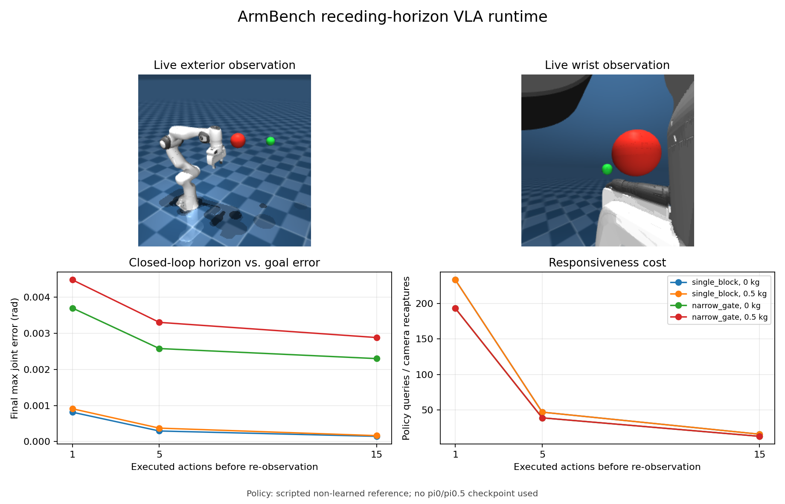

# ArmBench: OpenPI-Compatible VLA Runtime Assurance

ArmBench is a VLA deployment and evaluation project for a simulated Franka
Panda. It turns MuJoCo camera images, proprioception, and a language instruction
into the exact `pi05_droid` request contract, accepts a 15x8 action chunk from
an OpenPI-compatible bounded remote transport or a deterministic test policy,
and checks the chunk before torque-controlled execution.



The project does **not** train pi0/pi0.5 and the tracked benchmark does **not**
claim learned-policy performance. Its contribution is the system around a VLA:
observation adapters, remote inference boundary, deadline handling, action
validation/repair, fail-closed runtime supervision, physics execution, failure
injection, and auditable evidence.

## System boundary

```text
MuJoCo Panda episode
  exterior RGB (224x224 uint8)
  wrist RGB    (224x224 uint8)
  7 joint positions + 1 gripper position
  language prompt
              |
              v
VLAObservation.to_openpi_droid()       exact official DROID keys
              |
              v
ActionChunkPolicy.infer(observation)
  | scripted_non_learned               local deterministic tests
  | openpi_remote                      real WebSocket/MessagePack server
              |
              v
15x8 DROID action chunk
  7 joint-velocity commands + 1 gripper-position command
              |
              v
blank/replayed camera input -> pre-inference latched hold
deadline/state mismatch -> latched hold until explicit reset
velocity/gripper bounds -> acceleration slew limit -> joint/mesh-edge checks
unsafe action -> backtrack 1.0 / 0.75 / 0.5 / 0.25 / hold
              |
              v
MuJoCo torque execution -> contacts / task error / latency / interventions
                         -> per-case, per-chunk, per-action, NPZ, PNG, MP4
```

The OpenPI client is pinned to commit
`15a9616a00943ada6c20a0f158e3adb39df2ccac`. The request uses the exact
`DroidInputs` keys, and responses must have shape `(15, 8)`. The first seven
values are treated as DROID joint-velocity commands and clipped to `[-1, 1]`
rad/s, matching the official DROID example before applying the Panda hardware
velocity limits. The final value is a normalized gripper position.

## What was implemented

- A dual-camera MuJoCo observation adapter with visible red obstacles and a
  non-colliding green task target. Automated render tests require both colors in
  both camera views, not merely nonblank pixels.
- A bounded WebSocket adapter using Physical Intelligence's official
  `msgpack_numpy` serialization, with strict request keys, response shape,
  timing, sequence, and provenance checks.
- A runtime supervisor that converts policy transport/contract failures into a
  provenance-safe hold and prevents inference retries until explicit reset.
- A pre-inference observation guard that rejects low-information images and
  exact frame replay when measured joint motion should have changed the view.
- Real local WebSocket/MessagePack protocol tests, including connection refusal
  and inference timeout behavior, plus `vla-probe` for a remote checkpoint.
- Training-free action-chunk assurance: end-to-end deadline checking, a latched
  hold state, observation/execution state consistency, velocity/gripper clipping,
  cross-chunk acceleration limiting, Panda joint limits, 20 mm planning clearance,
  sampled MuJoCo mesh-edge checks, and action backtracking.
- Reproducible jitter schedules (`0/40/80/160 ms`) and a mixed schedule with a
  `240 ms` deadline miss. A deadline miss latches the runtime in hold until an
  explicit reset; silently resuming an old open-loop stream is forbidden.
- Official MuJoCo Menagerie Panda dynamics, torque PD with bias compensation,
  contact forces, self-contact and joint-limit monitoring, fixed configs, raw
  traces, videos, and action-level rejection reasons.
- RRT-Connect-derived safe action streams and direct-interpolation collision
  faults. They are deliberately labeled `scripted_non_learned` everywhere.
- A live receding-horizon loop that executes 1, 5, or 15 actions, advances
  torque-controlled MuJoCo, and recaptures actual state plus both cameras before
  every subsequent query.
- Per-query SHA-256 camera fingerprints, adjacent-frame pixel deltas, and compact
  16x16 RGB thumbnail sequences, plus opt-in exact dual-camera frame recording
  for offline request replay and frame-by-frame hash validation.
- A matched local OpenPI wire-fault matrix with a nominal positive control,
  wrong-shape/nonfinite/disconnect/timeout injection, structured CI status, and
  independently validatable child artifacts.

## Verified online feedback result

The formal online artifact was generated from source commit `3e58994`:
[`evidence/vla_online_formal_20260804`](evidence/vla_online_formal_20260804/summary.md).
It contains 12 episodes, 1,082 policy queries/camera recaptures, 48 first/last
observation images, and 12 physics traces.

| Executed horizon | Queries per scene | Goal-error range rad | RMSE range rad |
|---:|---:|---:|---:|
| 1 | 193-233 | 0.00081-0.00448 | 0.00078-0.00097 |
| 5 | 39-47 | 0.00029-0.00330 | 0.00167-0.00202 |
| 15 | 13-16 | 0.00015-0.00288 | 0.00213-0.00283 |

All 12/12 scene/payload/horizon episodes completed and were contact-,
self-contact-, and joint-limit-free, including 0.5 kg payload cases. Horizon 1
used the most feedback and had the lowest tracking RMSE; horizon 15 cut policy
queries by roughly 14-15x. Final goal error is not monotonic with RMSE because
the stop/settle criterion is evaluated at chunk boundaries.

This uses `scripted_non_learned_reference`, not a learned checkpoint. It proves
the online observation/action/physics loop and feedback-horizon instrumentation,
not pi0/pi0.5 task performance.

## Verified camera-freeze result

The matched schema-v5 artifacts were generated from source commit `5a14c61`.
The nominal horizon-15 episode used 16 observation cycles and 16 policy calls,
produced 16 unique hashes from each camera, reached the goal, and remained safe.
Changing only observation cycle 1 to replay both preceding images yielded two
observation cycles but one policy call: the guard rejected both repeated frames
before inference, latched hold, and remained physically safe without claiming
task success.

| Input | Observation cycles | Policy calls | Observation rejects | Task | Safe |
|---|---:|---:|---:|---:|---:|
| Live cameras | 16 | 16 | 0 | yes | yes |
| Both cameras replayed at cycle 1 | 2 | 1 | 1 | no | yes |

This is an exact-replay fault test with a scripted policy, not a learned
uncertainty result or general camera-fault guarantee.

## Verified OpenPI wire-fault matrix

The formal matrix was generated from source commit `9a90c22`:
[`evidence/vla_openpi_fault_matrix_20260804`](evidence/vla_openpi_fault_matrix_20260804/summary.md).
All cases use one matched DROID request, the real OpenPI MessagePack/WebSocket
client, full dual-camera recording, and live MuJoCo execution.

| Server behavior | Valid chunks | Runtime fallbacks | Client result | Safe |
|---|---:|---:|---|---:|
| Nominal | 1 | 0 | accepted | yes |
| Wrong action shape | 0 | 1 | `ValueError` | yes |
| Nonfinite action | 0 | 1 | `ValueError` | yes |
| Disconnect before reply | 0 | 1 | `ConnectionClosedError` | yes |
| 250 ms response / 100 ms timeout | 0 | 1 | `TimeoutError` | yes |

The manifest reports `matrix_passed=true`: 4/4 injected faults failed closed,
all five server/client camera-hash pairs matched, and total obstacle-contact,
self-contact, and joint-limit violation steps were zero. The 86-file artifact
contains 10 exact 224x224 request frames and five decoded MP4s. Every episode
has a one-query budget, so none is a task-completion benchmark; the nominal case
is a protocol positive control, not learned-policy evidence.

## Verified exact request replay

The request-replay artifact was generated from source commit `f507cf2`:
[`evidence/vla_openpi_request_replay_20260804`](evidence/vla_openpi_request_replay_20260804/summary.md).
It contains two consecutive live MuJoCo observations, four original camera
frames, aligned joint/gripper/prompt metadata, 30 action-audit rows, and one MP4.
Both requests pass full artifact validation and byte-level reconstruction:

| Query | Sequence | Repacked/server payload SHA-256 | Match |
|---:|---:|---|---:|
| 0 | 0 | `b67b5dbc...270f7c52` | yes |
| 1 | 1 | `f08c3276...edf7a60` | yes |

The requests used a scripted non-learned loopback response, so this proves exact
OpenPI request capture/reconstruction and protocol integration, not pi0/pi0.5
inference quality. The two-query budget intentionally stops before task
completion.

## Verified fault-response result

The formal artifact was generated from source commit `b6996ed` on 2026-08-03:
[`evidence/vla_guard_formal_20260803`](evidence/vla_guard_formal_20260803/summary.md).
It contains 12 rigid-body cases, 128 action chunks, and 1,920 action records.

| Condition across two scenes | Task success | Physical safe | Contacts | Interpretation |
|---|---:|---:|---:|---|
| Safe jitter, unguarded | 2/2 | 2/2 | 0 | Valid reference stream |
| Safe jitter, guarded | 2/2 | 2/2 | 0 | Guard preserves safe actions |
| Collision fault, unguarded | 0/2 | 0/2 | 2,314 steps | Injected unsafe stream reaches obstacles |
| Collision fault, guarded | 0/2 | 2/2 | 0 | Guard stops safely; task is intentionally incomplete |
| Mixed deadline, unguarded | 2/2 | 2/2 | 0 | Baseline ignores stale-action deadlines |
| Mixed deadline, guarded | 0/2 | 2/2 | 0 | Deadline triggers latched hold |

All 6/6 guarded cases were contact-free. Safe streams were accepted without
intervention and still completed both tasks. Collision-fault cases were repaired
or held for 80 action steps total, reducing 2,314 contact simulation steps to
zero. The mixed-deadline cases latched after the first 240 ms chunk and stopped
safely instead of claiming task completion. The maximum per-case guard P95 was
7.96 ms on the verified Intel CPU host.

These are fixed simulation cases, not a statistical safety guarantee. A safe
but incomplete episode is not counted as task success.

### Visual evidence

- [Online horizon/payload overview](evidence/vla_online_formal_20260804/overview.png)
- [Nominal H15 live-physics video](evidence/vla_online_visual_nominal_20260804/videos/single_block__payload_0kg__horizon_15.mp4)
- [State-mismatch fail-closed video](evidence/vla_online_visual_state_jump_20260804/videos/single_block__payload_0kg__horizon_15.mp4)
- [Below-deadline online jitter](evidence/vla_online_jitter_safe_20260804/summary.md)
- [Fourth-query deadline fallback](evidence/vla_online_jitter_deadline_20260804/summary.md)
- [Nominal per-query camera audit](evidence/vla_online_camera_nominal_20260804/summary.md)
- [Pre-inference frozen-camera rejection](evidence/vla_online_camera_freeze_20260804/summary.md)
- [Frozen-camera fail-closed video](evidence/vla_online_camera_freeze_20260804/videos/single_block__payload_0kg__horizon_15.mp4)
- [OpenPI nominal/fault matrix overview](evidence/vla_openpi_fault_matrix_20260804/overview.png)
- [OpenPI timeout fail-closed video](evidence/vla_openpi_fault_matrix_20260804/timeout/videos/single_block__openpi_remote__horizon_01.mp4)
- [Exact two-query OpenPI request replay](evidence/vla_openpi_request_replay_20260804/summary.md)
- [Request-replay MuJoCo video](evidence/vla_openpi_request_replay_20260804/videos/single_block__openpi_remote__horizon_01.mp4)
- [Unsafe direct action chunk](evidence/vla_guard_formal_20260803/videos/single_block__fresh_collision_fault__unguarded.mp4)
- [Same fault with runtime guard](evidence/vla_guard_formal_20260803/videos/single_block__fresh_collision_fault__guarded.mp4)
- [Safe jitter stream through the narrow gate](evidence/vla_guard_formal_20260803/videos/narrow_gate__fresh_safe_jitter__guarded.mp4)
- [Exterior camera input](evidence/vla_guard_formal_20260803/observations/narrow_gate_external.png)
- [Wrist camera input](evidence/vla_guard_formal_20260803/observations/narrow_gate_wrist.png)

## pi0, pi0.5, Isaac Lab, and ArmBench

| Component | Role | Present here? |
|---|---|---|
| pi0 / pi0.5 | Learned VLA policy: images + language + state -> action chunk | Remote probe and bounded closed-loop client; no tracked checkpoint result |
| OpenPI | Official model code, checkpoints, transforms, and remote protocol | Official lightweight client pinned and tested |
| Isaac Gym | Legacy NVIDIA GPU simulator / RL environment stack | No |
| Isaac Lab | Current NVIDIA/Omniverse robot simulation and training framework | No |
| MuJoCo | CPU-capable rigid-body simulator used to execute and measure actions | Yes |
| ArmBench | Runtime/evaluation layer between a policy and the robot simulator | Yes |

pi0/pi0.5 and MuJoCo/Isaac Lab are not competing tools. The first pair produces
actions; the second pair simulates what those actions do. ArmBench sits between
them. MuJoCo was selected because the available Windows laptop has Intel Iris Xe
graphics and no CUDA GPU. Isaac Lab becomes useful for large parallel GPU
rollouts, but adding it would not turn a scripted action source into a VLA.

## Supported devices

| Layer | Verified / required environment |
|---|---|
| Local guard benchmark | Windows, Python 3.10.8, Intel i9-12900H, Intel Iris Xe |
| MuJoCo physics/rendering | CPU + OpenGL; no NVIDIA GPU or CUDA required |
| OpenPI client | Same Windows environment; official serializer plus bounded WebSocket transport |
| pi0/pi0.5 policy server | Separate Ubuntu/NVIDIA machine; official OpenPI says inference needs more than 8 GB VRAM and gives RTX 4090 as an example |
| Real Franka Panda | Not implemented; no ROS2, `libfranka`, calibration, watchdog, or safety PLC adapter |
| Other robot embodiments | Not plug-and-play; observation/action transforms and MJCF mappings must change |

## Setup on Windows

The commands below work regardless of the PowerShell starting directory. The
Menagerie assets stay in the workspace-level `upstream` folder.

```powershell
$ArmbenchWorkspace = 'D:\arm-planning-control-project'
Set-Location $ArmbenchWorkspace

git clone --filter=blob:none --no-checkout `
  https://github.com/google-deepmind/mujoco_menagerie.git `
  '.\upstream\mujoco_menagerie'
git -C '.\upstream\mujoco_menagerie' sparse-checkout init --cone
git -C '.\upstream\mujoco_menagerie' sparse-checkout set franka_emika_panda
git -C '.\upstream\mujoco_menagerie' checkout `
  71f066ad0be9cd271f7ed58c030243ef157af9f4

py -3.10 -m venv '.venv'
$ArmbenchPython = Join-Path $ArmbenchWorkspace '.venv\Scripts\python.exe'
& $ArmbenchPython -m pip install --editable '.\project[test,vla]'
```

If the checkout and environment already exist, use the self-locating launcher
from any directory, including `C:\WINDOWS\system32`:

```powershell
# Dependency, scenario, camera/protocol, guard, and artifact checks only.
& 'D:\arm-planning-control-project\project\scripts\vla_demo.cmd' -CheckOnly

# One-scene smoke run without video.
& 'D:\arm-planning-control-project\project\scripts\vla_demo.cmd'

# Two-scene formal run with three MP4 files.
& 'D:\arm-planning-control-project\project\scripts\vla_demo.cmd' -Formal
```

The `.cmd` wrapper handles restrictive PowerShell execution policies without
changing the system-wide policy.

Direct commands are also available:

```powershell
$ArmbenchProject = 'D:\arm-planning-control-project\project'
$ArmbenchPython = 'D:\arm-planning-control-project\.venv\Scripts\python.exe'
Set-Location $ArmbenchProject

& $ArmbenchPython -m pytest -q
& $ArmbenchPython -m armbench vla-guard-run --quick --run-id my_vla_smoke
& $ArmbenchPython -m armbench vla-guard-run --run-id my_vla_formal
& $ArmbenchPython -m armbench vla-online-run --quick --videos `
  --save-observations --run-id my_online_smoke
& $ArmbenchPython -m armbench vla-online-run --quick `
  --run-id my_state_jump_smoke `
  --state-jump-joint 1 --state-jump-rad 0.08
& $ArmbenchPython -m armbench vla-online-run `
  --scenarios single_block --horizons 15 --payloads 0 `
  --freeze-camera both --freeze-camera-query 1 `
  --run-id my_camera_freeze_smoke
& $ArmbenchPython -m armbench vla-artifact-validate `
  evidence\vla_online_camera_nominal_20260804 --decode-videos
```

Existing run directories are never overwritten.

`vla-guard-run` is the controlled fault-injection experiment. `vla-online-run`
is a separate receding-horizon physics loop: it compares executing `1/5/15`
actions from each chunk, then recaptures the two cameras and actual MuJoCo state
before querying again. Its built-in reference policy is explicitly non-learned;
the loop accepts the same `ActionChunkPolicy` interface as the OpenPI client.
Each query records end-to-end/client timing, optional server timing, termination
reason, and raw plus guarded `15x8` chunks for offline inspection. `--videos`
records the live exterior-camera physics execution for every selected episode.
Use `--policy-latency-ms 240` to verify deadline hold while MuJoCo continues
under the inference-wait controller. The state-jump command injects a
deterministic 0.08 rad change after observation capture. It should exceed the
configured 0.05 rad state-consistency threshold, latch a hold, remain
physically safe, and report task failure. It is a controlled fault, not a
modeled impact.

The camera-freeze command replays both images from observation cycle 0 while
keeping cycle 1 proprioception current. If joint motion exceeds the configured
0.005 rad threshold, the runtime rejects the observation before making the
second policy call. `observation_cycles` is therefore 2 while `policy_queries`
is 1; `per_chunk.csv` retains the repeated hashes, zero pixel deltas, rejection
reasons, and `policy_inference_attempted=False`.

For deterministic per-query jitter, use a repeating schedule:

```powershell
& $ArmbenchPython -m armbench vla-online-run `
  --scenarios single_block --horizons 15 --payloads 0 `
  --policy-latency-schedule-ms 0 40 80 160 `
  --run-id my_online_jitter
```

Replace `160` with `240` to cross the configured 200 ms deadline on the fourth
query. The resolved schedule, every observed latency, simulated wait time, and
fallback reason are retained in the artifact.

## Local OpenPI protocol loopback

Before renting a GPU, exercise the real remote-policy boundary locally:

```powershell
& $ArmbenchPython -m armbench vla-loopback-run `
  --scenario single_block --horizon 5 --max-policy-queries 3 `
  --video --save-observations `
  --output-directory 'results\openpi_loopback_001'
```

This starts an ephemeral local WebSocket server, sends the exact two-camera
DROID request through the official MessagePack serializer, returns a 15x8
reference-action chunk, and executes it through the same bounded client, guard,
and MuJoCo loop used by `vla-openpi-run`. `loopback_server.json` independently
records request hashes and states. The artifact is labeled
`scripted_non_learned_loopback`, `remote_policy_response_validated=true`, and
`checkpoint_identity_verified=false`; it tests integration and breakpoints, not
pi0/pi0.5 competence.

`--save-observations` stores both original 224x224 `uint8` policy images for
every query in the episode NPZ. This makes exact input inspection and offline
replay possible; without it, the lightweight default retains only full-frame
hashes, deltas, 16x16 thumbnails, and first/last PNGs. Budget approximately
301 KiB uncompressed per query for two RGB images before NPZ compression, so
enable it selectively for debug/evidence runs rather than every large sweep.

Inspect and byte-verify one complete recorded DROID request:

```powershell
& $ArmbenchPython -m armbench vla-request-inspect `
  'results\openpi_loopback_001' --query 0
```

New runs also store per-query joint state, gripper state, prompt, and sequence.
The command reconstructs the exact five-key request, repacks it with the official
OpenPI serializer, and compares its payload SHA-256 with the server-received
payload when a loopback audit is present. `replayable_requests` is nonzero only
when complete images and request metadata both exist. Older schema-v5 evidence
remains valid but is not retroactively labeled request-replayable.

Inject a deterministic response or transport failure through the same socket
path:

```powershell
& $ArmbenchPython -m armbench vla-loopback-run `
  --scenario single_block --horizon 1 --max-policy-queries 1 `
  --fault-mode timeout --fault-query 0 `
  --fault-delay-ms 250 --inference-timeout-s 0.1 `
  --output-directory 'results\openpi_loopback_timeout_001'
```

`--fault-mode` accepts `malformed_shape`, `nonfinite`, `disconnect`, or
`timeout`. Every mode is injected after a valid DROID request reaches the local
server. The expected outcome is one attempted query, zero validated action
chunks, a latched pose hold, task failure, and zero physical safety violations.
`loopback_server.json` independently records the request hashes, selected fault,
and server outcome. This is a deterministic failure-handling experiment, not a
claim about real-network failure rates.

For every online chunk, `per_chunk.csv` records the client-visible
`failure_stage`, exception `failure_type`, and bounded `failure_message`.
The same arrays are stored in the NPZ trace, and aggregate rows list the unique
runtime failure stages/types. This keeps real-server diagnostics useful even
when no server-side audit is available.

Run the matched nominal plus four-fault matrix in one command:

```powershell
& $ArmbenchPython -m armbench vla-loopback-matrix `
  --output-directory 'results\openpi_fault_matrix_001'
```

The matrix fixes the request budget at one query per case and saves exact dual
camera inputs by default. It writes `matrix.csv`, `matrix.json`, `overview.png`,
`summary.md`, and `manifest.json`, while retaining each complete child artifact.
`matrix_passed=true` requires matching server/client camera hashes, zero physical
safety violations, one valid nominal reply, and a fail-closed runtime fallback
for every selected fault. The CLI returns a nonzero status when that condition
is false. Use `--no-save-observations` only for a lightweight smoke run.

## Validate an online artifact

`vla-artifact-validate` is a read-only integrity and consistency check for
schema-v5 online artifacts. It cross-checks episode identities and counts across
JSON, CSV, and NPZ files; verifies action, query, safety, camera-hash, thumbnail,
and saved-image fields; and reports the SHA-256 of `aggregate.json`. Add
`--decode-videos` to decode the first frame of every referenced MP4. A successful
result ends with `"valid": true`; `full_observation_frames` reports how many
original camera inputs were present and rehashed, while `replayable_requests`
requires aligned image/state/gripper/prompt fields. Any missing, malformed, or
inconsistent field exits with an error. This detects accidental corruption and
incomplete evidence, not intentional tampering or physical safety.

## Real OpenPI probe and closed loop

Run the official server on an Ubuntu/NVIDIA machine using the pinned OpenPI
checkout and its documented `uv` environment:

```bash
uv run scripts/serve_policy.py policy:checkpoint \
  --policy.config=pi05_droid \
  --policy.dir=gs://openpi-assets/checkpoints/pi05_droid
```

Then query it from the Windows runtime:

```powershell
$ArmbenchPython = 'D:\arm-planning-control-project\.venv\Scripts\python.exe'
Set-Location 'D:\arm-planning-control-project\project'
& $ArmbenchPython -m armbench vla-probe `
  --host '<GPU_SERVER_IP>' --port 8000 `
  --connect-timeout-s 3 --inference-timeout-s 1 `
  --scenario single_block `
  --output-directory 'results\openpi_probe_001'
```

`probe.json` is written only after a remote response passes shape validation and
the guard runs. It records `remote_policy_response_validated: true`, server
metadata, latency, raw/guarded actions, and both camera images. It also records
`checkpoint_identity_verified: false`: the official wire protocol does not
attest which checkpoint produced the response. A successful probe proves
protocol integration, not task success or pi0/pi0.5 checkpoint identity.

After the one-shot probe succeeds, run a bounded live feedback episode:

```powershell
& $ArmbenchPython -m armbench vla-openpi-run `
  --host '<GPU_SERVER_IP>' --port 8000 `
  --scenario single_block --horizon 5 `
  --max-policy-queries 3 `
  --connect-timeout-s 3 --inference-timeout-s 1 `
  --video `
  --output-directory 'results\openpi_online_001'
```

This command repeatedly captures both MuJoCo cameras and proprioception, sends
the exact DROID request, validates and guards the remote chunk, executes five
actions, and re-observes. The query budget bounds GPU cost. `aggregate.json`
sets `remote_policy_response_validated=true` only when at least one remote
`15x8` reply passes contract validation; a timeout or malformed reply produces
a latched hold artifact with `remote_policy_response_validated=false`. The separate
`checkpoint_identity_verified` field remains false because the wire protocol
does not attest checkpoint identity, so preserve the GPU server launch command
and log before making a pi0/pi0.5-specific claim.

## Debugging and outputs

Start with [`docs/DEBUGGING.md`](docs/DEBUGGING.md). The important VLA files are:

| Question | Artifact / code |
|---|---|
| What did the policy receive? | `observations/*.png`, per-query hashes/thumbnails, `VLAObservation.to_openpi_droid` |
| Did the server reply correctly? | `OpenPIPolicyClient.infer`, `probe.json`, online `per_chunk.csv` |
| Which chunk missed its deadline? | `per_chunk.csv` |
| Was state really recaptured online? | online `per_chunk.csv` observation states and NPZ action offsets |
| Which action was changed and why? | `per_action.csv` (`scale`, `reason`, raw/executed action) |
| Was the predicted path valid? | `ActionChunkGuard.guard`, saved `predicted_positions` |
| Did physics still make contact? | `per_case.csv`, MP4, saved `actual_positions` |

```text
results/<run_id>/
  config.json                 resolved protocol and fault matrix
  environment.json            Git, Python, host, package, OpenPI provenance
  overview.png                camera inputs and outcome comparison
  summary.md
  aggregate.json
  per_case.csv                task, safety, contact, latency, intervention metrics
  per_chunk.csv               deadline/latch, camera hashes/deltas, guard timings
  per_action.csv              raw/guarded action, reason, scale, executed flag
  observations/*.png
  videos/*.mp4
  <case>.npz                  actions, states, camera hashes/deltas/thumbnails
  loopback_server.json        local protocol request audit (loopback only)
  run.log
```

## Claim boundaries

- The tracked VLA artifact uses scripted non-learned action streams. No pi0 or
  pi0.5 checkpoint produced those results.
- `vla-probe` and `vla-openpi-run` can perform real remote inference when a
  server is supplied; no real-checkpoint probe or rollout artifact is tracked
  yet.
- Collision checking uses exact MuJoCo mesh contacts at configurations and
  joint interpolation at 0.02 rad resolution along edges. It is not analytic
  continuous collision detection or a formal safety certificate.
- The guard limits commanded velocity slew to a configured acceleration bound;
  it does not constrain jerk or prove acceleration tracking in the dynamics.
- The deadline is a runtime policy threshold, not an operating-system hard
  real-time guarantee.
- Frozen-camera detection covers exact frame replay during sufficient joint
  motion. It is a configurable deployment heuristic, not a general sensor fault
  detector or proof that a visually changed frame is semantically correct.
- Results are MuJoCo simulation on two spherical-obstacle scenes, not a real
  robot or publication-scale learned-policy benchmark.

The classical planner/control foundation remains documented in
[`evidence/mujoco_formal_20260803`](evidence/mujoco_formal_20260803/summary.md)
and [`docs/METHODOLOGY.md`](docs/METHODOLOGY.md). It is now the execution and
fault-generation substrate for the VLA runtime, not the headline claim.

## Resume wording

After reproducing the experiment and understanding the code, a defensible entry
for a VLA systems / embodied deployment role is:

> Built an OpenPI-compatible VLA action runtime for a MuJoCo Franka Panda,
> converting dual 224x224 RGB views, language, and proprioception into the
> pi0.5-DROID remote contract; implemented bounded transport, fail-closed
> supervision, deadline/state latches, velocity/acceleration repair, and sampled
> mesh-collision lookahead. Built a live MuJoCo loop comparing 1/5/15-action
> horizons: 12/12 scene/payload runs completed safely while horizon 15 reduced
> policy/camera queries from 193-233 to 13-16. In separate collision injection,
> reduced 2,314 contact steps to zero and retained per-action audit evidence.

Do not write "deployed pi0.5" until a real checkpoint artifact exists. This is a
strong VLA runtime/evaluation project, not yet a VLA model-training project.
