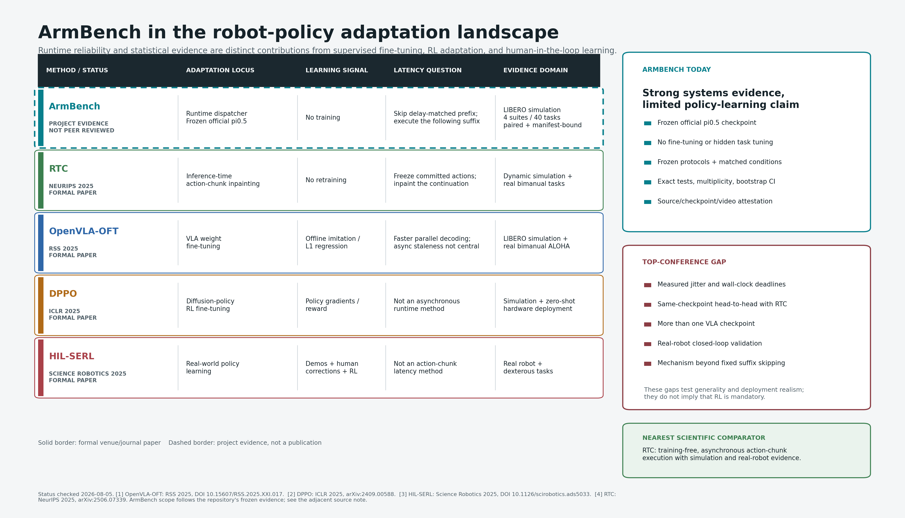

# VLA top-venue engineering gap analysis

Status checked: 2026-08-05. This is a targeted engineering review, not a claim
of exhaustive coverage. Formal proceedings and journal records are separated
from arXiv-only work. The reproducible metadata catalog is
`vla_runtime_literature_metadata.json`; the refresh and validation command is
`scripts/verify_vla_runtime_literature.py`.

## Bottom line

ArmBench is now a credible systems and evaluation project, but it is not yet a
top-conference method paper. Its strongest evidence is unusually disciplined
for a portfolio project: an attested official pi0.5 checkpoint, paired LIBERO
conditions, frozen protocols, exact paired tests, multiplicity correction,
bootstrap intervals, complete videos, and manifest-bound artifacts. The
training-free temporal dispatcher also produced a large and independently
replicated effect under deterministic 200 ms delay.

The scientific gap is not simply "no RL." The closest formal comparator is RTC
(NeurIPS 2025), which changes flow-policy inference itself by freezing already
committed actions and inpainting a continuation. ArmBench currently sees only a
completed action chunk and drops a fixed, oracle-known prefix. It therefore
cannot yet claim non-oracle latency handling, policy-internal replanning,
multi-model generality, or real-robot validity.

The next defensible project thesis is:

> Can a frozen VLA remain useful under measured, variable response age when a
> runtime must choose a fresh suffix or fail closed before its deadline?

That question is closer to the project's demonstrated strength than adding a
small PPO run that does not address stale actions.

## Retrieval and evidence classes

The bounded catalog contains eleven primary works selected because they expose
a concrete engineering route relevant to VLA runtime reliability:

- formal VLA foundations and adaptation: RT-2, OpenVLA, OpenVLA-OFT, FAST, and
  ConRFT;
- formal reinforcement-learning routes: DPPO and HIL-SERL;
- formal asynchronous runtime work: RTC;
- recent arXiv-only asynchronous routes: VLASH, FutureRTC, and Action
  ControlNet.

Publication identity was checked against official RSS, PMLR, ICLR, NeurIPS, or
publisher pages where available. arXiv was used for versioned preprint metadata,
OpenAlex for independent indexing, and Crossref for registered DOI metadata.
An arXiv DOI never promotes a work to "formal." API failures are retained in
the metadata artifact rather than interpreted as absence.

## What the strongest systems actually add

| Route | Main intervention | Training / equipment burden | What ArmBench should learn from it |
| --- | --- | --- | --- |
| RT-2, CoRL 2023 | Co-fine-tunes vision-language and robot-action data into a generalist VLA | Large, closed training stack and robot data | Establishes the model class, but is not a practical personal-project baseline |
| OpenVLA, CoRL 2024 | Open 7B VLA and reproducible adaptation path | Substantial GPU fine-tuning, public checkpoints | Best route to a second model family and cross-model runtime evidence |
| OpenVLA-OFT, RSS 2025 | Parallel continuous action generation and action chunking with optimized supervised fine-tuning | Offline training plus simulation and real ALOHA evaluation | Demonstrates that decoding and training changes must be separated from runtime-only gains |
| FAST, RSS 2025 | Compresses continuous robot actions into efficient tokens | Tokenizer and VLA training | Relevant to serving cost and horizon design, not by itself a stale-response solution |
| ConRFT, RSS 2025 | Reinforced VLA fine-tuning through a consistency-policy route | Offline/online adaptation and intervention data | A serious RL comparison, far beyond a decorative PPO baseline |
| DPPO, ICLR 2025 | Treats diffusion denoising as an RL process and applies policy-gradient fine-tuning | Parallel simulation or GPU physics plus multi-seed training | Useful only if the research question becomes reward-driven policy improvement |
| HIL-SERL, Science Robotics 2025 | Asynchronous real-world actor/learner loop with demonstrations and human corrections | Real robot, human supervision, reward learning, and online RL | Shows why real-world RL evidence is expensive and why a toy simulation run is not equivalent |
| RTC, NeurIPS 2025 | Freezes committed flow-policy actions and inpaints a consistent continuation at inference time | Requires access inside the flow-policy sampling process; includes real-robot evidence | Closest direct comparator and the present method-quality target |
| VLASH, arXiv 2025 | Future-state-aware asynchronous VLA inference | Learned future-state mechanism | Directly targets the stale-observation weakness; formal status not established in this review |
| FutureRTC, arXiv 2026 | Anticipatory conditioning and learned execution-time context | Learned prediction/adaptation modules | Raises the bar beyond time-only prefix selection; preprint evidence must be treated cautiously |
| Action ControlNet, arXiv 2026 | Lightweight delay-aware adapter for smooth asynchronous handoff | Parameter-efficient adapter training | A useful learned-adapter control, but not training-free; preprint only as of the access date |

## Where ArmBench is already strong

ArmBench should be presented as a runtime reliability and evidence-engineering
project, not as a newly trained policy:

- It evaluates the pinned official `pi05_libero` checkpoint rather than a mock
  policy for its formal LIBERO claims.
- It preserves the training-free intervention boundary: the VLA checkpoint is
  frozen, and only action dispatch changes.
- The confirmatory Spatial study and separately frozen Object, Goal, and
  LIBERO-10 external study cover 40 tasks and 600 rollouts in total. These are
  two study families, not one post-hoc pooled experiment.
- Every matched condition keeps the same initial state, task, horizon, and seed;
  success is analyzed with paired methods rather than independent proportions.
- Source, checkpoint, protocol, CSV, manifest, and video consistency are
  independently checked. Runtime failures remain in intention-to-test counts.

This is enough for a strong graduate-level portfolio project because an
interviewer can run the validator, inspect a matched video pair, recompute the
statistics, and trace the action-selection code. It is not enough for a top
paper because the current causal intervention is still narrow.

## Exact gap to a top-venue method paper

### 1. Oracle timing versus measured timing

The published ArmBench result injects four known delay steps and gives the same
number directly to the dispatcher. That isolates a causal mechanism cleanly,
but it is an oracle protocol. A deployed runtime observes timestamps and
response arrival; it does not receive the experimenter's hidden delay label.

The new measured-age core added after the frozen study closes only the software
part of this gap. It measures end-to-end observation age, applies a
pre-registered floor or conservative-ceil conversion, and checks whether the
requested suffix remains inside the action horizon. It has unit evidence, not
closed-loop pi0.5 evidence yet, and must not be used to relabel the old 200 ms
result.

### 2. Fixed suffix skipping versus policy-consistent continuation

ArmBench assumes that action `k` is the appropriate command after roughly `k`
control periods. RTC instead operates inside flow inference and constructs a
continuation consistent with already committed actions. VLASH and FutureRTC add
future-state information. The present websocket API returns only a completed
chunk, so an honest RTC baseline requires an OpenPI server/model extension; it
cannot be recreated by renaming an external array slice.

### 3. One VLA checkpoint versus method generality

The formal result uses one pi0.5-LIBERO checkpoint. Four suites establish task
breadth, not model breadth. A method claim should include at least one genuinely
different open checkpoint family, such as OpenVLA-OFT through its native
evaluation stack, and should preserve each model's action semantics rather than
forcing incompatible outputs into one wrapper.

### 4. Simulation versus deployment evidence

LIBERO is appropriate for controlled paired statistics, but RTC and HIL-SERL
include hardware evidence. A real deployment needs independently ticking
control and inference loops, timestamped sensor capture, watchdogs, reconnect
behavior, command limits, and an emergency-stop boundary. Post-hoc advancement
of a blocked simulator is a useful model, not a hard-real-time controller.

### 5. Temporal feasibility versus physical feasibility

The formal LIBERO path checks temporal suffix availability but does not project
pi0.5 end-effector actions through joint, velocity, acceleration, and continuous
collision constraints. ArmBench has these ingredients in its separate MuJoCo
Panda path, but the two evidence paths are not yet one causal experiment.

## Why adding RL now would not automatically improve the project

DPPO, ConRFT, and HIL-SERL are strong because reward design, training scale,
baselines, multi-seed evaluation, and in HIL-SERL real hardware all support a
policy-learning claim. Running PPO for a few hours on a toy reward would add a
framework name while weakening the central story: it would not explain stale
action chunks, would not be comparable to the frozen pi0.5 result, and would
introduce reward and training confounds.

RL becomes justified only after choosing a different research question, such
as learning recovery after a fail-closed intervention or adapting a compact
latency predictor. At that point the minimum credible comparison includes
behavior cloning or supervised adaptation, multiple training seeds, learning
curves, matched environment steps, and a no-adaptation runtime control.

## Staged route toward the literature

### Stage A: non-oracle measured-age pilot

Freeze a new schema and run a small, explicitly exploratory pi0.5-LIBERO pilot
with `async_unguarded`, legacy oracle alignment, and measured-age alignment.
Use a mode-independent SHA-256 keyed jitter schedule, conservative-ceil
rounding at 20 Hz, bounded hold-refresh, and a pre-registered deadline. Report
success, policy queries, observation-age P50/P95/max, estimator offset,
deadline misses, horizon overruns, refreshes, and intervention rate.

Historical external artifacts contain 8,431 recorded policy queries. Their
ordinary P95 client time is about 82-83 ms, but each suite also has an
approximately 18.5 s first-query outlier consistent with compilation/warm-up.
This is calibration evidence, not a registered outcome. A measured-latency
study must run an attested, unscored warm-up before condition randomization or
the first assigned mode will absorb a severe order effect.

### Stage B: direct asynchronous-method baseline

Extend the pinned OpenPI server so the evaluator can pass committed actions and
execution timestamps into the flow sampler. Reproduce RTC or a clearly named
approximation on the same checkpoint and tasks. Compare completed-chunk prefix
selection against policy-internal continuation under the identical latency
trace. This is the shortest route from a strong project to a research-method
contribution.

### Stage C: cross-model and cross-simulator validity

Add OpenVLA-OFT or another open action-chunk model, then repeat a reduced frozen
matrix. Port only the evaluator contract to Isaac Lab if parallel GPU physics
or sensor randomization earns its cost; changing simulator without a new
scientific control is not itself a contribution.

### Stage D: physical constraints and hardware

Join the LIBERO temporal supervisor with the Panda feasibility layer through a
declared action adapter. Add IK/QP projection, continuous collision checking,
and deadline-bounded hold/recovery. A LeRobot-compatible hardware adapter or a
small real-Panda collaboration would then test whether the measured-age logic
survives real scheduling and sensor timestamps.

## Acceptance bar for future claims

The next public result should not be called complete until all of the following
are true:

- old deterministic evidence still validates byte-for-byte under its original
  schema;
- the new protocol is frozen before rollouts and has a distinct run ID;
- warm-up, jitter generation, timestamp origin, rounding, deadline, horizon,
  retry limit, and failure inclusion are recorded;
- paired modes receive the same initial state and keyed jitter sequence;
- every measured offset and decision can be recomputed from raw query records;
- a tampered age, offset, or deadline decision fails independent validation;
- the dashboard labels pilot, confirmatory, and external evidence separately;
- any top-paper comparison is run from its real implementation or explicitly
  labeled an approximation.

## Primary identifiers

- RT-2: PMLR 229, <https://proceedings.mlr.press/v229/zitkovich23a.html>
- OpenVLA: PMLR 270, <https://proceedings.mlr.press/v270/kim25c.html>
- OpenVLA-OFT: <https://doi.org/10.15607/RSS.2025.XXI.017>
- FAST: <https://doi.org/10.15607/RSS.2025.XXI.012>
- ConRFT: <https://doi.org/10.15607/RSS.2025.XXI.019>
- DPPO: <https://iclr.cc/virtual/2025/poster/28475>
- HIL-SERL: <https://doi.org/10.1126/scirobotics.ads5033>
- RTC: <https://neurips.cc/virtual/2025/poster/117747>
- VLASH: <https://arxiv.org/abs/2512.01031>
- FutureRTC: <https://arxiv.org/abs/2607.24008>
- Action ControlNet: <https://arxiv.org/abs/2606.25985>
